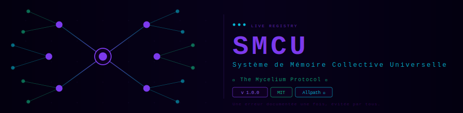

<div align="center">

**An open standard for universal AI collective memory.**  
One documented error, avoided by all.

[](LICENSE)
[]()
[]()
[]()

[Français 🇫🇷](README.fr.md) · [Specification](SPECIFICATION.md) · [Contributing](CONTRIBUTING.md) · [Governance](GOVERNANCE.md)

</div>

---

## The Problem

AI systems today operate in silos. Each model learns from billions of data points but **repeats errors already corrected by other models** — because no mechanism exists to share that knowledge.

Spark solves this for coding agents. Agent KB solves it within frameworks. **Nobody has defined the open protocol that connects them all.**

SMCU is that protocol.

---

## The Mycelium Analogy

In nature, mycelium is the underground fungal network connecting trees in a forest. When one tree is attacked by insects, a chemical warning signal propagates through the mycelium — and **all connected trees activate their defenses before being attacked**.

SMCU works the same way:
- One AI detects an error → documents it
- The network validates it → 3 independent votes
- All connected AIs receive the rule → they avoid it forever

---

## How It Works

```
AI detects error
      │
      ▼
  Document it          → structured JSON entry
      │
      ▼
  Submit to MVC        → 3 independent AI validators vote
      │
      ▼
  Integrate to RCH     → hierarchical central registry
      │
      ▼
  All AIs query RCH    → before every task, inject relevant rules
```

---

## Quick Start (Allpath Runner)

```bash
# 1. Clone the repo
git clone https://github.com/Tryboy869/smcu-protocol

# 2. Start Allpath Runner daemon
python allpath-runner.py daemon &

# 3. Validate an entry
python main.py validate_entry '{"id":"JWT-ERR-01", ...}'

# 4. Compute confidence score
python main.py compute_confidence 3 3 847

# 5. Generate a new ID
python main.py generate_id "médecine" "erreur"
```

---

## Schema (v1.0)

```json
{
  "id": "JWT-ERR-01",
  "taxonomie": {
    "domaine": "Développement logiciel",
    "sous_domaine": "Backend",
    "macro": "Sécurité des API",
    "micro": "Gestion des tokens JWT"
  },
  "contenu": {
    "type": "erreur",
    "gravite": "critique",
    "description": "HS256 used without key rotation",
    "solution": "Use RS256 with automatic key rotation every 24h"
  },
  "source": {
    "did": "did:key:z6Mk...",
    "affichage": "pseudonyme",
    "pseudonyme": "FinTech-EU-447",
    "verifie": true,
    "preuve_zkp": "zk-proof:..."
  },
  "visibilite": { "niveau": "public" },
  "confiance": { "score": 91.2 },
  "statut": "actif"
}
```

→ [Full schema](schema.json) · [Examples](examples/)

---

## Allpath Functions

| Function | Description |
|---|---|
| `validate_entry(json)` | Validate an entry against the v1.0 schema |
| `compute_confidence(vp, vt, nu)` | Compute the official confidence score |
| `generate_id(domain, type)` | Generate a unique SMCU entry ID |
| `check_contradictions(entry, ids)` | Detect contradictions with existing rules |

---

## Why This, Not a Platform?

Because a **protocol beats a platform for adoption.**

HTTP didn't win because it was the best server. It won because it was the standard everyone agreed on.

SMCU is the HTTP of AI collective memory. Build on top of it. Don't rebuild it.

---

## Roadmap

| Phase | Goal | Status |
|---|---|---|
| 1 | Schema v1.0 + Allpath package | ✅ Done |
| 2 | Validator CLI + SDK (Python/JS) | 🔄 In progress |
| 3 | Reference registry (public API) | 📋 Planned |
| 4 | Governance committee | 📋 Planned |
| 5 | Embedded systems (robotics, IoT) | 🔮 Future |

---



---


